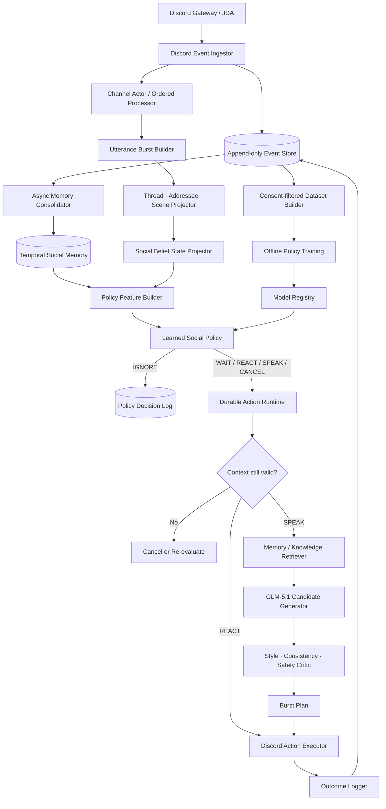

# NEXA 프로젝트 컨텍스트

> **이 문서는 구현 명령서가 아니다.**  
> NEXA를 왜 만드는지, 어떤 접근을 버렸는지, 현재 무엇을 사실·결정·가설·미해결 문제로 보는지 보존하는 프로젝트 장기 기억이다. Codex와 사람 개발자는 작업 전에 이 문서를 읽되, 실제 구현 범위는 `task graph`, ADR, ExecPlan, 테스트 계약을 따른다.

---

## 0. 문서 읽는 법

이 문서는 문장과 결론의 신뢰 수준을 다음 네 범주로 구분한다.

| 표기 | 의미 |
|---|---|
| **FACT** | 논문, 공식 문서, 실제 코드·실험 등 근거로 확인된 사실 |
| **DECISION** | NEXA에서 채택한 제품·아키텍처 결정. 증거가 바뀌면 ADR로 변경 가능 |
| **HYPOTHESIS** | 실험으로 검증해야 하는 가설. 사실처럼 구현하거나 홍보하면 안 됨 |
| **UNKNOWN** | 현재 연구와 내부 논의만으로 답이 없는 문제 |

이 문서는 대화에서 나온 아이디어를 미화하지 않는다. 초기에 제안했다가 사용자가 거부한 접근도 남긴다. 같은 실패를 다시 반복하지 않기 위해서다.

---

# 1. 한 페이지 요약

## 1.1 제품 정의

**DECISION — NEXA는 요청-응답형 Discord 챗봇이 아니다.**

NEXA는 Discord의 비동기 이벤트 스트림을 지속적으로 관찰하면서 다음 행동을 확률적으로 선택하는 **지속형 AI 멤버**다.

```text
IGNORE   아무 행동도 하지 않음
WAIT     지금은 말하지 않고 문맥 변화를 기다림
REACT    이모지나 짧은 비언어적 반응만 남김
SPEAK    특정 대상·시점·사회적 행위로 발화함
CANCEL   준비하거나 예약한 행동을 문맥 변화 때문에 취소함
```

사람다움의 핵심은 문장에 `ㅋㅋ`, `?`, 반말을 붙이는 것이 아니다.

> **NEXA에서 사람다움은 문체가 아니라 장기간의 행동 궤적이다.**

그 궤적에는 다음이 포함된다.

- 언제 관찰만 하는가
- 직접 불려도 언제 답하지 않는가
- 누구에게는 자주, 누구에게는 드물게 반응하는가
- 한 생각을 몇 개 메시지로 나누는가
- 말하려다가 왜 취소하는가
- 과거 관계와 사건을 어떻게 기억하고 갱신하는가
- 서버 문화에 맞춰 발화량과 반응 시간이 어떻게 변하는가

## 1.2 가장 중요한 결론

1. **침묵은 실패가 아니라 정식 행동이다.**
2. **직접 멘션은 응답 보장이 아니라 정책 입력 특징 중 하나다.**
3. **Discord 메시지 한 개는 인간의 대화 턴 한 개가 아니다.** 연속된 짧은 메시지는 먼저 하나의 발화 버스트로 묶어야 한다.
4. **GLM-5.1은 문구 생성기다.** 말할지·언제·누구에게 말할지는 별도 Social Policy가 결정한다.
5. **사회적 판단을 고정 규칙으로 완성하지 않는다.** 규칙은 안전·개인정보·최대 점유율 같은 경계에 사용하고, 참여 행동은 실제 동의받은 인간 로그에서 학습한다.
6. **`사람 평균 × 1.5`는 원시 메시지 수에 곱하지 않는다.** 학습된 발화 위험도 또는 행동 분포의 talkativeness bias로 적용한다.
7. **장기 기억은 벡터 검색 하나로 해결되지 않는다.** 출처, 시간 유효성, 갱신, 삭제, 모순을 추적해야 한다.
8. **백엔드 코드를 잘 짜는 것만으로 사람 같은 AI는 나오지 않는다.** 백엔드, 학습 데이터, 정책 모델, 평가 체계가 모두 필요하다.
9. **처음부터 LIVE로 말하게 하지 않는다.** OFF → SHADOW → CANARY → LIVE 순서와 명시적 게이트를 사용한다.
10. **목표는 인간 사칭이 아니다.** AI임을 명확히 드러낸 상태에서 사회적 참여가 자연스러워야 한다.

## 1.3 시스템의 세 층

```text
결정론적 런타임
  이벤트 수집·순서·멱등성·예약·취소·재생·개인정보

확률적 Social Policy
  침묵·대기·반응·발화·대상·시간·버스트 형태

언어 생성
  Social Policy가 SPEAK를 선택한 뒤 GLM-5.1로 실제 문구 후보 생성
```

**절대 금지:** GLM 호출 결과가 직접 Discord 메시지 전송 여부를 결정하게 만들지 않는다.

---

# 2. 문제를 발견한 과정

## 2.1 시작점: “죽은 Discord 서버를 살리고 싶다”

처음 문제는 활동이 멈춘 Discord 서버였다. 일반적인 커뮤니티 활성화 기능이 먼저 떠올랐다.

- 오늘의 질문
- 출석·생존 체크
- 조용한 멤버 멘션
- 답변 없는 질문 재노출
- 활동 랭킹
- 서버 근황 브리핑
- 대화 매칭

### 왜 폐기했는가

사용자 반응은 분명했다.

> 채팅을 살리는 것이 아니라 봇이 채팅방을 방해하고, 사람들에게 참여를 강제하는 느낌이다.

이 방식은 다음 문제를 가진다.

- AI가 커뮤니티의 MC나 담임처럼 군다.
- 사람을 수동적 참여자로 본다.
- 쉬러 온 공간에 의무감을 만든다.
- 서버가 조용할수록 봇 혼자 떠드는 기괴한 상황이 생긴다.
- 실제 대화 욕구가 아니라 알림과 압박으로 숫자만 만든다.

**REJECTED — NEXA는 서버를 대신 운영하거나 유저에게 말하라고 지시하지 않는다.**

## 2.2 두 번째 방향: “불렀을 때만 잘 대답하는 AI”

다음에는 공개 채팅에 먼저 끼어들지 않고, 호출되었을 때만 최근 문맥을 읽고 잘 답하는 AI를 생각했다.

예상 기능은 다음과 같았다.

- 방금 대화 기준으로 답변
- 결론만 추출
- 쉽게 설명
- 전문적으로 표현
- 반박
- 이전 논의 검색
- 긴 대화 압축

### 왜 이것도 부족했는가

이 기능들은 결국 사용자가 AI에게 명령하고 AI가 충실히 수행하는 **도구형 상호작용**이었다.

```text
사용자: @NEXA 결론만 말해줘
AI: 결론은 다음과 같습니다 ...
```

말투를 반말로 바꾸더라도 본질은 동일하다.

- 사용자가 작업을 지시한다.
- AI는 요청을 정확히 해석한다.
- AI는 최대한 도움이 되는 완성된 답을 제공한다.
- 한 호출이 한 응답으로 닫힌다.

**REJECTED — 공개 Social Mode에서 NEXA를 명령 수행 도구로 정의하지 않는다.**

## 2.3 세 번째 통찰: 사람은 지시를 그대로 따르지 않는다

사용자가 제시한 핵심 관찰은 다음과 같다.

> 사람은 다른 사람의 지시를 기계적으로 수행하지 않는다. 자기 해석, 기분, 관계, 농담, 귀찮음, 관심을 섞어서 반응한다.

이 통찰을 처음에는 “조금 반항하고 자기 의견을 넣는 AI”로 잘못 해석했다.

```text
사용자: 결론만 말해줘
NEXA: 결론만 말하면 너 지금 그거 하면 나중에 피봄. 근데 왜 하려는지는 이해됨 ...
```

이 답도 여전히 지나치게 도움이 되려고 한다. 사용자의 요구를 충실히 만족시키면서 인간적인 장식을 붙였을 뿐이다.

사용자가 제시한 더 자연스러운 예는 이쪽이었다.

```text
사용자: 결론만 말해줘
NEXA: ? ㅋㅋㅋ
NEXA: 아 결론은 이런 거라는 거임
```

또는:

```text
사용자: 결론만 말해줘
NEXA: 아니 내가 말한 게 결론만 말한 건디
```

중요한 차이는 무례함이 아니다.

> 사용자의 발화를 **작업 명령**으로만 처리하지 않고, 관계와 직전 맥락이 있는 **대화 행위**로 처리한다.

## 2.4 네 번째 통찰: 불렸다고 무조건 대답하는 것도 봇이다

가장 중요한 수정은 그 다음에 나왔다.

> 사람은 직접 불려도 자주 답하지 않는다.

사람은 다음 이유로 답하지 않는다.

- 못 봤다.
- 봤지만 귀찮다.
- 다른 사람이 이미 답했다.
- 대화가 너무 빠르게 흘러갔다.
- 지금 끼어들면 이상하다.
- 할 말은 있지만 중요하지 않다.
- 답을 쓰다가 상황이 바뀌었다.
- 그 사람과의 관계상 굳이 반응하지 않는다.
- 잠시 뒤 말하려 했지만 잊었다.

따라서 다음 정의도 폐기됐다.

```text
부르면 대답은 하지만 시키는 대로 하지는 않는 AI
```

더 정확한 정의는 다음이다.

> **NEXA는 불렸다는 사실까지 포함해 현재 사회적 장면을 해석하고, 아무 반응도 하지 않을 수 있는 AI 멤버다.**

## 2.5 다섯 번째 통찰: 메시지마다 판단하면 무조건 시끄러워진다

사용자가 제시한 Discord 대화 예시는 다음과 같은 형태였다.

```text
A: 닉네임
A: 바꿔
A: ㅃㄹ
A: 헷갈리니까
B: 웅
B: 니키
C: 음 그래그래
D: 그래
C: 아니
C: 코알라였음??????
C: 누군가 했네
```

여기서 `닉네임`, `바꿔`, `ㅃㄹ`, `헷갈리니까`는 네 번의 독립적인 질문이 아니다. 한 사람이 한 생각을 Discord식으로 쪼개서 쓴 **하나의 발화 버스트**다.

매 `MESSAGE_CREATE`마다 응답 결정을 하면:

```text
A: 닉네임
NEXA: ?
A: 바꿔
NEXA: 왜
A: ㅃㄹ
NEXA: ㅋㅋ
A: 헷갈리니까
NEXA: 알겠음
```

처럼 채팅방을 점령한다.

**DECISION — NEXA의 기본 판단 단위는 개별 메시지가 아니라 발화 버스트와 대화 장면이다.**

## 2.6 발화량 아이디어

사용자가 제시한 초기 제품 감각은 다음과 같다.

> NEXA는 평균적인 사람보다 조금 더 자주, 대략 1.5배 정도 반응하고, 서버 운영자가 배수를 설정할 수 있으면 좋다.

이 아이디어 자체는 유지한다. 단, 구현 해석은 수정한다.

```text
잘못된 구현:
AI 메시지 수 = 사람 메시지 수 × 1.5

권장 구현:
학습된 상황별 발화 위험도 × 서버 talkativeness multiplier
```

사람은 한 번의 발화를 여러 메시지로 쪼개므로 원시 메시지 수를 기준으로 하면 안 된다. `1.5x`는 **버스트 단위 참여 성향**을 조절해야 한다.

**HYPOTHESIS — 기본 1.5x가 존재감과 비방해성의 균형점일 수 있다. 실제 최적값은 서버별 실험으로 검증해야 한다.**

---

# 3. 최종 제품 철학

## 3.1 NEXA가 아닌 것

NEXA는 다음이 아니다.

- 죽은 서버에 정기적으로 떡밥을 던지는 봇
- 조용한 유저를 멘션하는 활성화 봇
- 모든 질문에 정확히 답하는 AI 어시스턴트
- 명령어를 자연어로 바꾼 업무 도구
- 반말과 슬랭을 붙인 ChatGPT
- 무작위로 사용자를 씹는 캐릭터 봇
- 인간인 척 속이는 봇
- 대화량을 최대화하는 engagement 최적화 봇
- 하나의 거대한 시스템 프롬프트로 성격을 연기하는 봇

## 3.2 NEXA가 지향하는 것

NEXA는 다음을 지향한다.

- 서버에 지속적으로 존재하는 AI 계정
- 대화의 흐름과 관계를 관찰하는 사회적 행위자
- 침묵할 수 있고, 기다릴 수 있고, 쓰던 말을 취소할 수 있는 행위자
- 사람마다 다른 관계 상태를 장기간 축적하는 행위자
- 자기 정체성과 취향은 유지하지만 상황마다 동일한 문구를 반복하지 않는 행위자
- 사용자의 명령보다 현재 장면과 관계를 우선할 수 있는 행위자
- AI임이 명확하지만 행동 리듬은 Discord 멤버처럼 자연스러운 행위자

## 3.3 사람다움의 정의

**DECISION — 사람다움은 네 층에서 평가한다.**

### 참여 층

- 말할지 말지
- 언제 말할지
- 누구에게 말할지
- 이모지인가 텍스트인가
- 말하려다 취소하는가

### 표현 층

- 한 문단인가 여러 짧은 버블인가
- 완성문인가 조각난 채팅인가
- 서버의 어휘와 리듬을 얼마나 따르는가
- 같은 표현을 반복하는가

### 관계 층

- 모든 유저를 동일하게 대하지 않는가
- 상호작용의 친밀도와 장난 허용도가 누적되는가
- 관계 변화가 갑자기 리셋되지 않는가

### 시간 층

- 며칠·수주·수개월이 지나도 정체성과 기억이 유지되는가
- 바뀐 사실을 이전 사실보다 우선하는가
- 과거 일을 상황에 맞게 떠올리고, 필요 없을 때는 꺼내지 않는가

## 3.4 Social Mode와 Utility Mode

**DECISION — 공개 채팅의 NEXA Social Mode는 응답을 보장하지 않는다.**

장래에 확실한 도구 기능이 필요하면 별도 모드를 둔다.

```text
Social Mode
- 공개 채팅
- 멘션도 응답 보장 없음
- 사회적 정책이 행동 결정
- 자연스러운 침묵과 취소 허용

Utility Mode (선택적 미래 기능)
- 명시적 명령, 전용 채널 또는 DM
- 성공/실패 응답 계약 존재
- 사회적 멤버 행동과 UI·로그·지표를 분리
```

두 기대를 하나의 모드에 섞으면 사용자는 “왜 필요한 순간에 답하지 않느냐”와 “왜 매번 끼어드느냐”를 동시에 느끼게 된다.

---

# 4. 핵심 결정 기록

## D-001 — 침묵을 정식 행동으로 모델링한다

`null`, timeout, 오류가 아니라 `IGNORE`를 명시적인 정책 출력으로 기록한다.

## D-002 — 멘션은 응답 트리거가 아니다

멘션은 응답 가능성을 높일 수 있지만 최종 행동은 장면, 관계, 최근 발화량, 타인 응답, 관심도 등을 함께 본다.

## D-003 — 메시지를 발화 버스트로 집계한다

개별 Discord 메시지에 정책을 실행하지 않는다. 같은 작성자의 연속 메시지, typing, 시간 간격, 타인 개입 등을 이용해 버스트 경계를 만든다.

## D-004 — 정책과 언어 생성을 분리한다

Social Policy가 `SPEAK`를 선택하기 전에는 GLM-5.1을 호출하지 않는다.

## D-005 — 사회적 행동은 학습하고, 규칙은 경계에 사용한다

규칙이 담당할 영역:

- 허용 채널
- 동의·삭제·보존 정책
- 외부 API 전송 허용 범위
- 최대 메시지 점유율
- Discord rate limit
- 안전 필터
- kill switch

학습 정책이 담당할 영역:

- 침묵, 대기, 리액션, 발화
- 대상과 타이밍
- 사회적 행위
- 버스트 형태

## D-006 — 행동을 확률분포로 유지한다

항상 argmax만 고르지 않는다. 같은 장면에서 인간도 항상 같은 행동을 하지 않으므로, 보정된 분포에서 정책적으로 샘플링한다.

## D-007 — 발화량 배수는 hazard 또는 calibrated bias로 적용한다

원시 메시지 수를 목표로 하지 않는다. 서버별 talkativeness 설정은 학습된 분포를 무너뜨리지 않는 범위에서 적용한다.

## D-008 — 모든 예약 행동은 취소 가능하다

다른 사람이 먼저 답했거나 주제가 바뀌면 예약된 답변을 폐기한다. 첫 번째 버블을 보낸 뒤에도 남은 버블을 취소할 수 있다.

## D-009 — 장기 기억은 시간 유효성과 출처를 가진다

모든 파생 기억은 근거 이벤트, 생성 시각, 유효 기간, 신뢰도, 대체 관계, 삭제 상태를 가져야 한다.

## D-010 — 실제 동의받은 인간 행동 데이터가 핵심 자산이다

합성 데이터만으로 최종 Social Policy를 만들지 않는다. 실제 Discord 분포의 오타, 짧은 버스트, 침묵, 관계별 응답 패턴이 필요하다.

## D-011 — Shadow Mode를 선행한다

정책을 먼저 관찰자로 배포해 행동을 예측하고 기록하되 Discord outbound를 구조적으로 차단한다.

## D-012 — 단일 engagement 보상을 사용하지 않는다

대화량만 최적화하면 도발, 과잉개입, 중독적 행동을 학습할 수 있다. 보상과 평가는 다차원이어야 한다.

## D-013 — 기존 모노레포를 갈아엎지 않는다

기존 Kotlin/Spring Boot 헥사고날 구조와 SSOT를 보존하며 신규 bounded context를 점진적으로 추가한다.

## D-014 — NEXA는 AI임을 명확히 표시한다

“인간처럼 느껴짐”은 자연스러운 참여를 뜻하며 인간 사칭이나 기만을 뜻하지 않는다.

---

# 5. 폐기한 접근과 실패 이유

| 접근 | 왜 매력적으로 보였나 | 왜 폐기·제한했나 |
|---|---|---|
| 오늘의 질문·출석 체크 | 즉시 메시지 수 증가 | 참여 강요, 스팸, 운영자 봇 느낌 |
| 조용한 유저 멘션 | 침묵 유저 재활성화 | 사회적 압박, 불쾌감, 자율성 침해 |
| 호출 시 항상 답변 | 제품 예측 가능성 | 사람 멤버가 아니라 도구가 됨 |
| “반항적인 프롬프트” | 사람 같은 말투 | 여전히 명령을 수행하고 도움을 줌 |
| `멘션이면 70% 응답` | 구현이 쉬움 | 맥락 없는 규칙, 서버별 문화 무시 |
| 무작위 무응답 | 쉽게 침묵 구현 | 필요한 순간도 씹는 불합리한 행동 |
| 매 메시지 정책 실행 | 이벤트 처리 단순 | 짧은 메시지마다 끼어들어 채팅 점령 |
| GLM 단독 scheduler | 빠른 프로토타입 | 비용·지연·보정·재현성·학습 통제 약함 |
| 시스템 프롬프트 하나 | 개발 속도 | 장기 일관성 없음, 도움형 문체로 회귀 |
| 벡터 DB top-k 기억 | 구현 용이 | 오래된 사실, 농담, 수정·삭제 충돌 |
| AI 메시지 수 1.5배 고정 | 직관적 설정 | 메시지와 발화가 다르고 장면을 무시 |
| 합성 데이터만 학습 | 개인정보·수집 부담 감소 | 실제 Discord 분포와 관계 역학 부족 |
| LLM judge 단독 평가 | 평가 자동화 | 학습된 스타일을 과대평가할 가능성 |
| 실시간 engagement RL | 빠른 적응 | reward hacking과 사회적 조작 위험 |
| 처음부터 end-to-end 거대 모델 | 차세대적으로 보임 | 실패 원인 분리 불가, 데이터 부족, 운영 위험 |

---

# 6. 연구 조사 결과

## 6.1 연구를 읽을 때의 주의

이 분야는 빠르게 변하고 있으며, 2025~2026년 결과 중 일부는 아직 arXiv preprint다. 논문이 보여준 제한된 실험 결과를 Discord 장기 제품의 성공 보장으로 해석하면 안 된다.

특히 다음 차이를 항상 구분한다.

- 역할극·게임과 실제 친목 Discord
- 10~30분 세션과 수개월 관계
- “도움이 되는 개입”과 “멤버다운 참여”
- 사람처럼 보이는 문장과 사람 같은 행동 생성 과정
- LLM 평가와 실제 사용자 장기 경험

## 6.2 핵심 논문 지도

| 연구 | 상태 | 핵심 결과 | NEXA가 가져올 것 | 그대로 가져오지 않을 것 |
|---|---|---|---|---|
| Generative Agents (2023) | UIST 2023 | 기억·성찰·계획이 believable behavior에 기여 | 경험 기록, reflection, 계획 분리 | sandbox의 그럴듯함을 실제 Discord 장기성으로 간주 |
| SOTOPIA (2024) | ICLR 2024 | LLM의 사회적 목표 수행이 인간보다 낮은 어려운 상황 존재 | 동적 사회성 평가, 다차원 rubric | 단일 LLM judge 점수를 진실로 취급 |
| SOTOPIA-π (2024) | ACL 2024 | 행동 모방+상호작용 학습으로 사회적 성능 개선 | BC 후 제한적 강화학습 | 평가 모델 과대평가 위험 무시 |
| Inner Thoughts (2025) | CHI 2025 | 내부 생각·표현 동기를 둔 proactive agent가 baseline보다 좋은 평가 | pending intent, 말하지 않은 생각 보존 | 사람이 정한 동기 임계값을 최종 정책으로 사용 |
| Controlling AI Participation (2025) | IUI 2025 | AI가 대화를 지배하면 싫어하며 사용자는 참여 제어권을 원함 | talkativeness·채널·모드 제어 | 시스템이 사용자 통제 없이 개입량 결정 |
| Time to Talk (2025) | Findings EMNLP 2025 | scheduler와 generator 분리, 비동기 그룹 게임에서 타이밍은 인간 패턴과 유사 | 타이밍/내용 분리, 비동기 평가 | Mafia 성공을 일반 Discord 성공으로 일반화 |
| DiscussLLM (2025) | arXiv preprint | silent token과 개입 분류 학습, 분리형 구조의 효율성 | 작은 intervention policy, silent supervision | “도움이 되는 개입”만 최적화 |
| HUMA (2025) | arXiv preprint | 이벤트 기반 Router/Action/Reflection과 지연 시뮬레이션으로 짧은 그룹채팅에서 높은 human-likeness | event runtime, cancelable flow, timing | 인간으로 오인시키기를 제품 목표로 삼음 |
| Speak or Stay Silent (2026) | arXiv preprint | 8개 LLM 제로샷 실패, SFT로 balanced accuracy 최대 23%p 개선 | 침묵은 명시적 학습 대상 | binary speak/silent만으로 관계·버스트 해결 가능하다고 봄 |
| When2Speak (2026) | arXiv preprint | 215K+ 예제, SFT는 과도하게 보수적, 비대칭 RL로 recall 개선 | FIR/MIR 균형, 비대칭 보상 | 합성 데이터 결과를 실사용 분포로 간주 |
| GroupGPT (2026) | arXiv preprint | 작은 모델이 개입 판단, 큰 모델이 생성; privacy sanitization | small-large 분리, 클라우드 최소 전송 | 직접 멘션을 무조건 응답 경로로 우회 |
| LIFELONG-SOTOPIA | OpenReview/preprint | 에피소드가 누적될수록 believability와 goal 성능 하락 | 30/90일 장기 평가 필수 | 메모리만 붙이면 장기 사회성이 해결된다고 가정 |
| LoCoMo (2024) | 연구 benchmark | 장기 대화에서 시간·인과 기억이 어려움 | 장기 memory eval fixture | QA 정확도만으로 관계 기억 평가 |
| LongMemEval (2024/2025) | 연구 benchmark | 정보 추출·다중 세션·시간·업데이트·abstention 평가 | memory update와 abstention | retrieval recall을 전체 기억 품질로 간주 |
| Memora (2026) | arXiv preprint | 오래된 기억 재사용을 명시적으로 벌주는 FAMA 제안 | stale-memory penalty | 최신 preprint 결과를 확정 사실로 과대해석 |
| STALE (2026) | arXiv preprint | 업데이트된 증거를 찾아도 행동에 반영하지 못하는 문제 | write-side state adjudication | 검색 시점에만 충돌을 해결 |
| Neural Hawkes Process (2017) | NeurIPS 2017 | 불규칙 연속시간 이벤트의 종류·시점 intensity 모델링 | 향후 marked temporal policy의 수학적 기반 | 첫 버전부터 복잡한 TPP로 시작 |

## 6.3 연구별 해석

### 6.3.1 Generative Agents

기억, 반성, 계획을 LLM 주변의 명시적 아키텍처로 분리하면 개별·집단 행동의 그럴듯함이 개선될 수 있음을 보여준 대표 연구다.[^R1]

NEXA에 주는 의미:

- LLM 문장 생성만으로 지속적인 행위자가 되지 않는다.
- 사건 기록과 고수준 reflection을 분리해야 한다.
- 정체성·계획·기억을 모두 최근 prompt에 납작하게 넣지 않는다.

한계:

- 시뮬레이션 세계의 believable behavior와 실제 Discord 사용자의 장기 신뢰는 다르다.
- 정교한 침묵 정책이나 비동기 발화 위험도를 직접 해결하지 않는다.

### 6.3.2 SOTOPIA와 SOTOPIA-π

SOTOPIA는 동적인 사회 목표, 관계 형성, 전략적 의사소통을 평가하며 어려운 시나리오에서 강한 모델도 인간보다 낮은 성과를 보일 수 있음을 보여준다.[^R2] SOTOPIA-π는 행동 모방과 상호작용 기반 자기강화를 결합해 작은 모델의 사회적 목표 수행을 개선했지만, LLM 평가가 학습된 에이전트를 과대평가할 수 있다는 문제도 확인했다.[^R3]

NEXA에 주는 의미:

- 사회성은 응답 품질 하나가 아니라 여러 목적을 동시에 가진다.
- behavior cloning으로 시작한 뒤 상호작용 단위 학습을 고려할 수 있다.
- LLM judge만으로 출시를 결정해서는 안 된다.

### 6.3.3 Proactive Conversational Agents with Inner Thoughts

CHI 2025 연구는 multi-party conversation에서 다음 화자 예측만으로는 부족하며, 에이전트가 내부적으로 생각 후보를 만들고 표현 동기가 충분한 시점을 찾는 구조를 제안했다.[^R4]

NEXA가 채택하는 부분:

- `PendingIntent` 또는 thought reservoir
- 지금 말하지 않은 생각이 나중에 다시 활성화될 수 있는 구조
- 말하기 전 동기·관련성·대화 균형 평가

NEXA가 수정하는 부분:

- 내부 생각을 장문의 자연어 chain-of-thought로 영구 저장하지 않는다.
- 동기 점수와 임계값을 사람이 고정하지 않고 학습 정책으로 옮긴다.
- private reasoning을 제품 로그나 사용자에게 노출하지 않는다.

### 6.3.4 Controlling AI Agent Participation in Group Conversations

IUI 2025 연구는 그룹 브레인스토밍에서 AI 참여가 유용할 수 있지만, AI가 대화를 지배한다고 느낄 때 사용자가 싫어하며 언제·무엇을·어디서 말할지에 대한 통제를 원한다는 결과를 보고했다.[^R5]

NEXA에 주는 의미:

- `talkativenessMultiplier`는 부가 설정이 아니라 핵심 제품 제어다.
- 채널별 OFF/SHADOW/CANARY/LIVE가 필요하다.
- 운영자가 즉시 mute/kill할 수 있어야 한다.
- 모델이 똑똑하더라도 참여권을 독점하면 실패한다.

### 6.3.5 Time to Talk

Findings EMNLP 2025 논문은 비동기 Mafia 게임에서 generator와 scheduler를 분리했고, 에이전트의 “언제 말할지” 패턴은 인간과 상당히 비슷했지만 메시지 내용에는 차이가 남았다고 보고했다.[^R6]

NEXA에 주는 의미:

- 타이밍 정책과 언어 생성은 반드시 분리한다.
- 메시지 수와 타이밍 분포를 인간과 비교한다.
- typing delay와 periodic reevaluation이 필요하다.

한계:

- 역할과 목표가 명확한 Mafia 게임이다.
- scheduler가 LLM prompt에 크게 의존한다.
- 장기 관계와 기억 갱신을 다루지 않는다.

### 6.3.6 DiscussLLM

DiscussLLM은 모델이 개입할 필요가 없을 때 silent token을 출력하도록 학습하고, end-to-end 구조와 classifier-generator 분리 구조를 비교했다.[^R7]

NEXA에 주는 의미:

- 작은 정책 모델로 저비용·저지연 판단이 가능하다.
- 침묵 예제를 명시적으로 데이터에 넣어야 한다.
- 정책 모델과 generator의 학습 목표를 분리할 수 있다.

한계:

- 개입 유형이 주로 사실 교정·정의·정보 제공처럼 “도움” 중심이다.
- NEXA가 원하는 잡담·관계·무반응 분포보다 assistant에 가깝다.

### 6.3.7 HUMA

HUMA는 메시지, 답글, 리액션을 이벤트로 다루고 Router, Action Agent, Reflection을 구성하며 현실적인 응답 지연을 시뮬레이션했다. 통제된 짧은 그룹채팅에서 참가자가 인간 운영자와 AI 운영자를 안정적으로 구분하지 못했다는 결과를 보고했다.[^R8]

NEXA에 주는 의미:

- 이벤트 기반 actor runtime
- 전송 전 재평가
- response-time simulation
- 텍스트 외 reaction을 독립 행동으로 취급

한계:

- facilitator 역할이다.
- 전략 목록과 프롬프트가 많은 부분을 담당한다.
- 장기 관계를 증명하지 않는다.
- “기만적으로 인간 같음”은 NEXA의 제품 목표가 아니다.

### 6.3.8 Speak or Stay Silent

2026년 preprint는 120K 이상의 multi-party decision point에서 8개 최신 LLM이 zero-shot turn-taking에 일관되게 실패했고, reasoning trace를 이용한 SFT가 balanced accuracy를 최대 23%p 개선했다고 보고했다.[^R9]

NEXA에 주는 가장 강한 결론:

> **FACT — 적절한 침묵은 일반 LLM에서 안정적으로 저절로 발생하는 능력으로 가정하면 안 된다. 명시적 학습과 평가가 필요하다.**

### 6.3.9 When2Speak

When2Speak는 16K 대화, 215K+ 예제로 temporal participation을 학습했다. SFT는 zero-shot보다 좋아졌지만 지나치게 조용해져 필요한 개입을 놓쳤고, 비대칭 보상의 RL로 recall을 높였다.[^R10]

NEXA에 주는 의미:

- class imbalance 때문에 정확도만 최적화하면 always-silent가 이길 수 있다.
- False Interruption Rate와 Missed Intervention Rate를 동시에 본다.
- 말 많음 배수는 단순 UI 값이 아니라 정책의 recall/precision trade-off다.

### 6.3.10 GroupGPT

GroupGPT는 작은 모델이 개입 시점을 판단하고 큰 모델이 생성하며, 민감한 메시지를 클라우드 전송 전에 정리하는 구조를 제안했다.[^R11]

NEXA에 주는 의미:

- Social Policy는 작은 모델로 분리할 수 있다.
- GLM에 모든 원문을 전송할 필요가 없다.
- intervention reasoning과 response generation을 각각 비용·지연·개인정보 관점에서 최적화한다.

NEXA와 다른 점:

- 해당 구조의 일부는 직접 멘션을 개입 judge보다 우선한다.
- NEXA는 직접 멘션도 응답 보장이 아니다.

### 6.3.11 LIFELONG-SOTOPIA

다중 에피소드가 누적될수록 테스트된 언어 에이전트의 goal achievement와 believability가 떨어졌고, 고급 기억을 사용해도 과거 상호작용을 명시적으로 이해해야 하는 어려운 상황에서는 인간보다 낮았다는 결과가 보고됐다.[^R12]

NEXA에 주는 의미:

- 짧은 데모의 자연스러움은 성공 지표가 아니다.
- 수주·수개월 평가가 별도 프로그램이어야 한다.
- 기억을 더 넣는 것만으로 관계 일관성이 해결되지 않는다.

### 6.3.12 장기 기억 연구

LoCoMo는 최대 수십 세션의 장기 대화에서 시간·인과 관계 이해가 여전히 어렵다는 점을 보여준다.[^R13] LongMemEval은 정보 추출, multi-session reasoning, temporal reasoning, knowledge update, abstention을 분리해서 평가한다.[^R14]

2026년 Memora는 오래된 기억을 다시 사용하는 실패를 별도로 벌주는 Forgetting-Aware Memory Accuracy를 제안했고, 기존 모델과 memory agent가 빈번한 갱신 압력에서 일관된 상태를 유지하기 어렵다고 보고했다.[^R15] STALE은 시스템이 최신 증거를 검색했더라도 실제 행동에서는 이전 상태를 계속 전제하는 실패를 보여주며, write-side state adjudication의 필요성을 제기했다.[^R16]

NEXA에 주는 의미:

- 기억은 `검색`이 아니라 `쓰기 → 판정 → 갱신 → 조회 → 행동 반영` 전체 루프다.
- 삭제·정정·닉네임 변경을 append-only 사건과 current projection으로 함께 관리한다.
- stale memory 사용률을 독립 지표로 측정한다.

## 6.4 연구에서 도출한 종합 결론

### FACT

- 그룹 대화에서 말할지 침묵할지는 일반 LLM의 zero-shot prompt만으로 안정적으로 해결되지 않는다.[^R9]
- scheduler와 generator 분리는 비동기 그룹 대화에서 유용한 구조다.[^R6]
- AI가 대화를 지배하면 사용자 경험이 나빠지고 참여 제어권이 필요하다.[^R5]
- 장기 상호작용에서는 현재 에이전트의 일관성과 사회적 성능이 저하될 수 있다.[^R12]
- 장기 기억은 오래된 정보의 무효화와 행동 반영에 취약하다.[^R15][^R16]

### DECISION

- NEXA는 학습된 Social Policy와 GLM generator를 분리한다.
- event/burst/scene 단위로 정책을 수행한다.
- 장기 평가와 stale-memory 평가를 release gate에 포함한다.

### HYPOTHESIS

- 실제 opt-in Discord 로그로 학습한 정책이 고정 규칙과 범용 LLM judge보다 자연스러운 참여 분포를 만들 것이다.
- 서버별 shadow calibration과 talkativeness multiplier가 문화 차이를 흡수할 수 있다.
- 구조화된 social act와 burst profile을 GLM-5.1에 주면 도움형 어시스턴트 문체 회귀를 줄일 수 있다.

### UNKNOWN

- “수개월 동안 사람 같은 멤버로 느껴짐”을 일반적으로 달성한 공개 연구는 아직 없다.
- Discord 친목 서버에서 장기 관계까지 해결하는 최적 정책 구조는 확립되지 않았다.
- 사람다움과 예측 가능성 사이의 제품적 최적점은 서버마다 다를 수 있다.

---

# 7. 과학적 문제 정의

## 7.1 챗봇이 아니라 비동기 사회 행동 생성

일반 챗봇 문제:

```text
입력 문장 x → 응답 문장 y
```

NEXA 문제:

```text
불규칙한 Discord 이벤트 e1...et
+ 현재 사회 상태 bt
+ 장기 기억 Mt
→ 다음 행동 a
→ 대상 target
→ 행동 시각 Δt
→ 사회적 행위 socialAct
→ 버스트 형태 burstProfile
```

이를 다음처럼 표현할 수 있다.

\[
b_t = f_\theta(b_{t-1}, e_t, M_t)
\]

\[
(a_t, target_t, \Delta t_t, socialAct_t, burst_t)
\sim \pi_\phi(\cdot \mid b_t)
\]

다른 사람의 실제 의도나 감정은 직접 관측되지 않으므로, 이 문제는 부분 관측 환경의 belief-state tracking, 즉 POMDP 관점이 적합하다.

## 7.2 행동 공간

초기 정식 행동 공간:

```text
IGNORE
WAIT(until or recheck condition)
REACT(messageId, reactionClass)
SPEAK(target, socialAct, delay, burstProfile)
CANCEL(pendingActionId)
```

향후 확장 가능 행동:

```text
CONTINUE_BURST
ABORT_REMAINING_BURST
CHANGE_TARGET
LEAVE_THREAD
ACK_WITHOUT_TEXT
```

## 7.3 Social Act

Social Act는 최종 문장이 아니라 “이 장면에서 어떤 사회적 행동을 하는가”다.

```text
ACKNOWLEDGE
AGREE
DISAGREE
TEASE
CORRECT
CONFUSION
ASK
SELF_DISCLOSE
CALL_BACK
DEFEND_PREVIOUS_POINT
CHANGE_TOPIC
SUPPORT
```

이 분류는 영구 고정 ontology가 아니다. 실제 로그의 행동 군집과 오류 분석을 통해 변경할 수 있다.

## 7.4 발화 위험도와 1.5배

연속시간 모델에서는 시간 `t`의 발화 위험도를 `λ_speak(t)`로 볼 수 있다.

\[
\lambda'_{speak}(t) = m_{guild} \cdot \lambda_{speak}(t)
\]

- `m_guild = 1.0`: 해당 서버의 일반 활성 유저 수준
- `m_guild = 1.5`: 조금 더 말 많은 멤버
- `m_guild = 0.5`: 조용한 멤버

이 방식은 원래 장면별 상대적 차이를 유지한다.

```text
두 사람이 빠르게 서로 대화 중
→ 기본 λ가 매우 낮음
→ 1.5배여도 낮음

NEXA가 잘 아는 화제 + 대화가 잠시 멈춤
→ 기본 λ가 중간
→ 1.5배 적용 시 참여 가능성 증가
```

첫 구현은 시간 구간 분류로 시작할 수 있다.

```text
NOW: 0~3초
SOON: 3~10초
LATER: 10~30초
DELAYED: 30~120초
NEVER
```

데이터가 충분해지면 survival model, marked temporal point process로 발전한다. Neural Hawkes Process는 불규칙한 이벤트의 종류와 시간 intensity를 함께 모델링하는 대표 기반이다.[^R17]

## 7.5 무작위성과 재현성

사람 같은 다양성을 위해 샘플링은 필요하지만, 운영·디버깅을 위해 결정은 재생 가능해야 한다.

모든 정책 결정에는 다음을 기록한다.

```text
sceneVersion
policyModelVersion
featureSchemaVersion
calibrationVersion
serverConfigVersion
randomSeed
sampledAction
full probability summary 또는 안전한 요약
```

같은 snapshot과 seed로 동일한 결정을 재현할 수 있어야 한다.

---

# 8. 목표 시스템 아키텍처

## 8.1 전체 흐름



## 8.2 네 개의 두뇌와 한 개의 안전 경계

### Conversation Brain

- Discord 이벤트를 인간 대화 단위로 재구성
- 발화 버스트
- 스레드
- 대상
- 장면 버전

### Social Policy Brain

- 지금 행동할지
- 행동 종류
- 대상
- 시간
- social act
- burst profile

### Memory Brain

- 사건
- 시간 유효 사실
- 관계 상태
- pending intent
- 정체성 커널

### Language Brain

- GLM-5.1을 사용한 실제 문구 후보 생성
- 정책이 정한 의도와 버스트 형태를 표현

### Safety / Runtime Boundary

- 동의
- 외부 전송 최소화
- 안전 필터
- 발화 상한
- 예약·취소
- rate limit
- kill switch

## 8.3 런타임 시퀀스

1. JDA 이벤트를 내부 정규화 이벤트로 변환한다.
2. 동의·보존 정책을 확인한다.
3. raw event를 append-only store에 기록한다.
4. `guildId/channelId` 기준 ordered processor가 이벤트를 소비한다.
5. 작성자의 현재 발화 버스트를 갱신한다.
6. 버스트 종료 여부를 판단한다.
7. reply, mention, 시간 인접성, 주제 변화를 이용해 스레드와 대상을 projection한다.
8. `sceneVersion`을 증가시킨다.
9. 관계·채널·NEXA 상태를 갱신한다.
10. feature contract를 생성한다.
11. Social Policy가 행동 분포를 출력한다.
12. 안전 경계와 talkativeness calibration을 적용한다.
13. seed를 포함해 행동을 샘플링하고 결정 로그를 남긴다.
14. `IGNORE`이면 종료하며 GLM 호출은 0회다.
15. `WAIT`이면 durable scheduler에 재평가를 예약한다.
16. `REACT`이면 실행 직전 sceneVersion을 검증한 뒤 반응한다.
17. `SPEAK`이면 실행 시점에 문맥을 다시 검증한다.
18. 현재 유효한 기억과 필요한 지식만 검색한다.
19. GLM-5.1이 2~N개의 문구 후보를 생성한다.
20. critic이 어시스턴트 문체, 반복, 모순, 안전 문제를 검사한다.
21. 통과 후보에서 샘플링해 BurstPlan을 만든다.
22. 각 버블 전송 직전에도 sceneVersion을 검증한다.
23. 문맥이 바뀌면 남은 버블을 취소한다.
24. 후속 인간 반응과 운영 지표를 outcome으로 기록한다.
25. 비동기 memory consolidator가 파생 기억을 생성·갱신한다.

---

# 9. 현재 모노레포에 통합하는 방향

## 9.1 현재 구조에 대한 전제

다음은 프로젝트 소유자가 제공한 인벤토리를 기준으로 한다. 실제 저장소와의 차이는 500단계 계획의 P00에서 검증한다.

```text
discord-assistant/
├── central-server/      Kotlin/Spring Boot + JDA 중앙 서버와 Discord 봇
├── provider-agent/      Python 기반 유저 PC 에이전트
├── protocol/            central ↔ agent wire contract SSOT
├── prototypes/desktop/  데스크톱 UI SSOT
├── games/
├── rag/
├── docs/ specs/ i18n/
└── packaging/ deploy/ scripts/
```

`central-server`는 헥사고날 도메인 우선 구조와 ArchUnit 규칙을 이미 사용한다. Flyway, protocol, UI, i18n 등 여러 SSOT가 존재한다.

**DECISION — NEXA 때문에 현재 구조를 새 프레임워크로 갈아엎지 않는다.**

## 9.2 신규 bounded context

```text
central-server/src/main/kotlin/com/discordassistant/central/
├── conversation/     이벤트·버스트·스레드·대상·장면
├── participation/    IGNORE/WAIT/REACT/SPEAK/CANCEL 정책
├── socialmemory/     시간 유효 기억·관계 projection·pending intent
├── actionruntime/    예약·재평가·취소·전송 상태 머신
└── speech/           GLM 후보·critic·버스트 계획
```

## 9.3 기존 도메인과의 책임 경계

| 기존 영역 | 유지할 책임 | NEXA에서 금지할 책임 |
|---|---|---|
| `platform/discord` | JDA 수신 정규화, outbound adapter | JDA 객체를 신규 domain에 직접 전달, 발화 정책 결정 |
| `channelai` | 채널 프로필, 모드, talkativeness 설정 | 자체 자동응답 타이밍 판단 |
| `routing` | provider-neutral 모델 호출, GLM 연결 | 침묵·발화·대상 결정 |
| `ainetwork` | 기존 니아 관계·호감도 데이터의 승인된 bridge | `socialmemory`와 같은 개념을 이중 write |
| `globalpromptset` | 안정적인 identity kernel | 실시간 관계·기분·발화 포화도 저장 |
| `knowledge` | SPEAK 이후 필요한 RAG | 모든 메시지마다 선제 검색 |
| `multiresponse` | 승인된 BurstPlan 실행 보조 | 메시지 수와 발화 여부 재결정 |
| `quota` | 실제 모델 generation 비용 제어 | IGNORE/WAIT 정책 판단 과금 |
| `requestlog` | 외부 모델 요청 감사 | policy decision log 대체 |
| `relay` / `provider-agent` | 기존 provider pool·reverse WS | NEXA 정책을 사용자 PC에 암묵적으로 분산 구현 |

## 9.4 provider-agent 경계

NEXA Social Policy의 권위 있는 상태는 `central-server`에 둔다.

이유:

- Discord 채널 전체 순서와 장면을 중앙에서 봐야 한다.
- 여러 provider-agent의 연결 상태와 관계없이 정책 일관성이 필요하다.
- 개인정보와 데이터셋 lineage를 한 곳에서 추적해야 한다.
- action scheduler와 JDA outbound가 중앙에 있다.

provider-agent는 기존 로컬 추론·이미지 provider 역할을 유지한다. NEXA 정책을 provider-agent 내부에 숨겨 구현하지 않는다.

## 9.5 패키지 내부 예시

```text
conversation/
├── domain/
│   ├── model/
│   ├── burst/
│   ├── scene/
│   └── service/
├── application/
│   ├── port/in/
│   └── port/out/
└── adapter/

participation/
├── domain/
│   ├── action/
│   ├── policy/
│   ├── feature/
│   └── calibration/
├── application/
└── adapter/
    ├── outbound/onnx/
    └── outbound/grpc/

socialmemory/
├── domain/
│   ├── episodic/
│   ├── temporal/
│   ├── relationship/
│   └── pendingintent/
├── application/
└── adapter/outbound/persistence/

actionruntime/
├── domain/
│   ├── scheduledaction/
│   ├── state/
│   └── cancellation/
├── application/
└── adapter/
    ├── outbound/persistence/
    └── outbound/discord/

speech/
├── domain/
│   ├── socialact/
│   ├── candidate/
│   ├── critic/
│   └── burstplan/
├── application/
└── adapter/outbound/glm/
```

도메인 패키지는 Spring, JPA, JDA, Z.AI SDK 타입에 의존하지 않는다. 기존 ArchUnit 원칙을 확장한다.

---

# 10. 주요 도메인 모델

## 10.1 정규화 이벤트

```kotlin
data class NormalizedConversationEvent(
    val eventId: EventId,
    val guildId: GuildId,
    val channelId: ChannelId,
    val actorId: MemberId?,
    val occurredAt: Instant,
    val receivedAt: Instant,
    val kind: EventKind,
    val consentScope: ConsentScope,
    val sourceVersion: String,
)
```

실제 payload는 이벤트 종류별 sealed type으로 분리한다.

## 10.2 발화 버스트

```kotlin
data class UtteranceBurst(
    val burstId: BurstId,
    val authorId: MemberId,
    val messageIds: List<MessageId>,
    val startedAt: Instant,
    val endedAt: Instant?,
    val replyTarget: MessageId?,
    val combinedText: String,
    val status: BurstStatus,
    val segmentationVersion: String,
)
```

버스트 경계 특징:

- 같은 작성자의 메시지 간격
- typing 이벤트
- 다른 사람의 개입
- reply target 변화
- 문장 종결·미완성 단서
- 작성자별 평소 burst size
- 현재 채팅 속도

## 10.3 장면

```kotlin
data class ConversationScene(
    val sceneId: SceneId,
    val channelId: ChannelId,
    val version: Long,
    val activeThreadIds: Set<ThreadId>,
    val activeParticipants: Set<MemberId>,
    val tempo: ConversationTempo,
    val addresseeDistribution: Map<MemberId, Double>,
    val updatedAt: Instant,
)
```

모든 예약 행동은 기반 `sceneVersion`을 가진다.

## 10.4 정책 행동

```kotlin
sealed interface SocialAction {
    data object Ignore : SocialAction

    data class Wait(
        val reevaluateAt: Instant,
        val reasonCode: WaitReason,
    ) : SocialAction

    data class React(
        val targetMessageId: MessageId,
        val reactionClass: ReactionClass,
        val delay: Duration,
    ) : SocialAction

    data class Speak(
        val targetMessageId: MessageId?,
        val targetMemberId: MemberId?,
        val socialAct: SocialAct,
        val delay: Duration,
        val burstProfile: BurstProfile,
    ) : SocialAction

    data class Cancel(
        val pendingActionId: ActionId,
    ) : SocialAction
}
```

## 10.5 예약 행동

```text
scheduled_social_action
- action_id
- guild_id
- channel_id
- based_on_scene_version
- policy_model_version
- policy_config_version
- execute_after
- expires_at
- payload
- status
- cancel_reason
- created_at
- updated_at
```

상태 예시:

```text
CONSIDERING
SCHEDULED
TYPING
PARTIALLY_SENT
COMPLETED
CANCELLED
EXPIRED
FAILED
```

## 10.6 시간 유효 기억

```text
memory_fact
- memory_id
- subject_key
- predicate
- object_value
- valid_from
- valid_to
- confidence
- source_event_ids
- supersedes_memory_id
- visibility_scope
- consent_scope
- deletion_status
- schema_version
```

예:

```text
2025-04-19: user_12.nickname = "코알라"
2025-06-02: user_12.nickname = "김숙", supersedes = 이전 기억
```

이전 사건을 지우지 않되 현재 조회에서는 최신 유효 상태가 우선한다.

## 10.7 Pending Intent

```text
pending_intent
- intent_id
- topic
- target_member_id
- target_thread_id
- social_act
- activation
- urgency
- novelty
- created_at
- expires_at
- source_event_ids
- status
```

자연어 장문의 비공개 사고를 저장하지 않는다. 행동에 필요한 구조적 의도와 근거만 저장한다.

---

# 11. Social Policy 학습 구조

## 11.1 왜 GLM-5.1만으로 해결하지 않는가

- 모든 이벤트에 대형 모델을 호출하면 비용과 지연이 크다.
- 외부 API 모델을 NEXA의 실제 행동 로그로 직접 fine-tune하기 어렵다.
- 일반 LLM은 요청에 답하고 도움을 주도록 강하게 학습되어 있다.
- 확률 보정, server-specific calibration, replay가 어렵다.
- API 호출 자체는 지속적인 내부 상태를 보유하지 않는다.

**DECISION — GLM-5.1은 언어 생성기이며 Social Policy의 권위가 아니다.**

## 11.2 단계별 모델 진화

### Baseline 0 — Always Silent

모든 장면에서 침묵한다. class imbalance를 드러내는 필수 기준선이다.

### Baseline 1 — Mention Heuristic

멘션, 질문 부호, 최근 발화량 같은 단순 규칙. 최종 제품이 아니라 비교 대상이다.

### Baseline 2 — Logistic / Gradient Boosting

구조화된 특징으로 행동을 분류한다. 데이터·평가 파이프라인 검증에 유용하다.

### Policy v1 — Temporal Encoder + Multi-head

```text
Event/Burst Encoder
→ Temporal Transformer 또는 State-space Encoder
→ Action Head
→ Target Head
→ Delay-bin Head
→ Social-act Head
→ Burst-shape Head
→ Calibration
```

### Policy v2 — Survival / Continuous-time

검열된 `NEVER`와 불규칙 시간을 다루는 survival model.

### Policy v3 — Marked Temporal Point Process

행동 종류와 발생 시간을 하나의 연속시간 분포로 모델링한다.

### Policy v4 — Offline Preference / RL

대화 구간 단위 다차원 보상으로 제한적으로 개선한다. 실시간 무제한 온라인 RL은 금지한다.

## 11.3 Masked Member Modeling

동의를 받은 실제 그룹 채팅에서 특정 인간 멤버의 행동을 가리고 예측한다.

```text
관측 입력:
- 대상 멤버 외 다른 사람의 이벤트
- 대상 멤버의 이전 행동 이력
- 시간, reply, reaction, typing
- 현재 서버 문화 특징

정답:
- 대상 멤버가 말했는가
- 언제 말했는가
- 누구에게 말했는가
- reaction인가 text인가
- 몇 개의 버블을 보냈는가
- 어떤 social act였는가
```

핵심 목표는 정확한 문장을 복원하는 것이 아니다.

> **한 사람 또는 유사한 활성 유저 집단의 행동 확률분포를 학습한다.**

## 11.4 데이터 split

- 같은 guild가 train과 test에 동시에 들어가지 않는다.
- 가능하면 시간 기준 holdout도 둔다.
- 동일한 밈·복사된 대화가 split을 넘지 않게 dedup한다.
- user identity는 가명화한다.
- training eligibility와 product retention은 별도 플래그다.

## 11.5 손실 함수 개념

\[
L = L_{action} + \alpha L_{target} + \beta L_{delay} + \gamma L_{burst}
+ \delta L_{socialAct} + \epsilon L_{calibration}
\]

정확도 하나가 아니라 calibration을 포함한다. `SPEAK=0.7`인 예제 집단에서 실제로 비슷한 비율로 말해야 정책 샘플링이 의미가 있다.

## 11.6 추론 배치

초기:

```text
학습: Python 3.12 + PyTorch
내보내기: ONNX
추론: central-server 내부 ONNX Runtime JVM
```

고급 temporal point process:

```text
학습/추론: 별도 Python ML service
통신: gRPC
계약: protobuf 또는 별도 policy contract SSOT
```

작은 모델과 계약이 안정되기 전에는 마이크로서비스를 먼저 만들지 않는다.

---

# 12. GLM-5.1 언어 생성 계층

## 12.1 호출 조건

`SPEAK`가 확정되고 전송 직전 문맥 재검증을 통과한 경우에만 호출한다.

```text
IGNORE → 0회
WAIT   → 0회
REACT  → 기본 0회
SPEAK  → 필요 시 1회 또는 제한된 후보 생성
```

Z.AI 공식 문서상 GLM-5.1은 장기 작업과 agent use case를 위한 모델이며 Java SDK와 일반 API를 제공한다.[^R20] 모델 ID와 endpoint는 설정 및 model registry 뒤에 둔다.

## 12.2 GLM 입력 계약

사용자의 마지막 문장을 명령으로 그대로 넘기지 않는다.

```json
{
  "identityKernelVersion": "nia-v3",
  "scene": {
    "summary": "사용자가 NEXA가 이미 결론을 말했다고 보는 상황",
    "tempo": "FAST_CASUAL",
    "target": "member-17"
  },
  "policy": {
    "socialAct": "DEFEND_PREVIOUS_POINT",
    "burstProfile": {
      "messageCountRange": [1, 2],
      "fragmented": true,
      "maxTotalCharacters": 80
    }
  },
  "relationship": {
    "familiarityBand": "MEDIUM",
    "teasingToleranceBand": "MEDIUM"
  },
  "validMemories": [],
  "recentContext": [],
  "forbidden": [
    "도움형 서론",
    "불필요한 목록",
    "근거 없는 친밀감",
    "다른 유저의 비공개 기억"
  ]
}
```

## 12.3 후보 생성과 critic

후보 예:

```text
후보 A
아니
그게 결론이었는데

후보 B
?
내가 말한 게 결론임

후보 C
아 더 줄여야 됨?
하지마
```

critic 검사:

- Social Act와 일치하는가
- 최근 NEXA 발화와 모순되는가
- “좋은 질문입니다”, “핵심은 다음과 같습니다” 같은 assistant regression이 있는가
- 지나치게 완결적·친절한 장문인가
- 서버 표현을 과장하거나 억지로 흉내 내는가
- 같은 표현을 반복하는가
- 안전·개인정보 문제가 있는가
- 현재 기억의 유효성을 위반하는가

최고 점수 하나만 고정 선택하지 않는다. 기준을 통과한 후보군에서 보정된 샘플링을 허용한다.

## 12.4 말투 학습의 원칙

- 특정 유저의 문장을 복제하지 않는다.
- 욕설·혐오표현·민감한 정체성 표현을 서버 문화라는 이유로 자동 모방하지 않는다.
- 슬랭은 표면 장식보다 발화 길이, 조각화, 응답 지연 분포를 우선한다.
- 자연스러움은 맞춤법 오류를 무작위로 삽입하는 것이 아니다.

---

# 13. 결정론적 Kotlin/Spring 런타임

## 13.1 백엔드 코드가 하는 일과 하지 못하는 일

백엔드가 보장할 수 있는 것:

- 이벤트 순서
- 멱등성
- 재생
- 취소
- 데이터 출처
- 모델 버전 추적
- 개인정보 경계
- 안전 상한
- 운영 rollback

백엔드만으로 만들 수 없는 것:

- 어떤 침묵이 자연스러운가
- 관계별 응답 분포
- 수개월간의 사회적 일관성
- 서버 문화 일반화
- 인간다운 행동 확률분포

따라서 NEXA의 성공은 다음 세 체계의 교집합이다.

```text
Software Architecture
× Learning Architecture
× Evaluation / Research Discipline
```

## 13.2 Channel Actor와 순서

같은 채널 이벤트를 여러 인스턴스가 동시에 처리하면 이중 발화와 stale 전송이 발생할 수 있다.

초기 권장:

```text
PostgreSQL append-only event/outbox
+ channel_id 기준 worker ownership 또는 advisory lock
+ 한 채널의 projection은 논리적 단일 writer
```

규모가 커진 뒤:

```text
Kafka partition key = channel_id
```

## 13.3 Kotlin 구현 원칙

- `Clock`을 주입한다.
- 난수 공급자를 주입하고 seed를 기록한다.
- 테스트에서 `Thread.sleep`을 사용하지 않는다.
- coroutine lifecycle은 application scope에 명시적으로 귀속한다.
- 외부 API는 port 뒤에 둔다.
- 도메인은 JDA·Spring·JPA·Z.AI SDK를 모른다.
- 예약과 전송은 transaction/outbox 경계를 명확히 한다.
- raw Discord content를 일반 로그에 남기지 않는다.

Kotlin coroutines는 비동기 처리에 적합하지만, coroutine을 쓴다는 사실 자체가 이벤트 순서와 exactly-once 효과를 보장하지 않는다. 상태 소유권과 persistence 설계가 별도로 필요하다.[^R21]

## 13.4 권장 인프라

```text
Kotlin + Spring Boot
JDA adapter
PostgreSQL + Flyway
pgvector: 의미 검색 보조
Redis: 짧은 TTL 상태·락·캐시만
S3/MinIO + Parquet: 동의된 학습 artifact
Python + PyTorch: 학습
ONNX Runtime JVM: 초기 정책 추론
MLflow 또는 동등 registry: 모델·실험 버전
OpenTelemetry + Prometheus + Grafana
```

Neo4j, Kafka, 별도 ML serving은 실제 병목과 데이터가 생긴 뒤 도입한다.

---

# 14. 기억 아키텍처

## 14.1 기억 계층

| 계층 | 내용 | 수명 |
|---|---|---|
| Raw Event | Discord 원본 사건과 변경 이력 | 정책에 따른 제한 보존 |
| Episodic Memory | 특정 시점의 사건 | 중장기 |
| Temporal Fact | 현재 또는 과거에 유효했던 사실 | 유효 기간 포함 |
| Relationship State | 관찰 가능한 상호작용에서 추정한 관계 | 감쇠·갱신 |
| Pending Intent | 말하지 않은 구조적 의도 | 짧은 TTL |
| Identity Kernel | NEXA의 안정적 가치·취향·금지선 | 버전 관리 |

## 14.2 관계 상태

저장 가능한 예:

```text
familiarity
interaction_reciprocity
teasing_tolerance
shared_topic_affinity
recent_response_pattern
unresolved_interaction_count
```

저장하면 안 되는 예:

```text
“이 유저는 우울증이 있다”
“이 유저는 특정 정치 성향이다”
“이 유저는 나를 사랑한다”
```

관찰 가능한 대화 행동을 넘어 민감한 심리·정체성을 추론해 영구 저장하지 않는다.

## 14.3 write-side adjudication

새 기억을 단순 append한 뒤 검색 시 LLM에게 충돌 해결을 맡기지 않는다.

```text
새 사건
→ 기존 관련 상태 검색
→ 동일 사실의 갱신인가
→ 모순인가
→ 농담·인용·타인 발언인가
→ 현재 유효 상태를 갱신할 수 있는가
→ 출처와 confidence 기록
```

불확실하면 기존 사실을 무효화하지 않고 `UNKNOWN/CONFLICTED` 상태로 둔다.

## 14.4 삭제 전파

삭제 또는 동의 철회 시 추적해야 하는 것:

```text
raw event
→ normalized event
→ burst
→ scene projection
→ memory fact
→ relationship observation
→ dataset row
→ trained artifact eligibility manifest
```

이미 학습된 모델에서 특정 데이터를 완벽히 제거할 수 없는 한계를 사전에 고지하고, 삭제 가능한 범위와 재학습 정책을 명확히 해야 한다.

---

# 15. 데이터·개인정보·윤리

## 15.1 기본 원칙

- guild 단위 명시적 opt-in
- 멤버에게 NEXA가 AI이며 어떤 데이터를 관찰하는지 명확히 고지
- 제품 사용 동의와 학습 데이터 사용 동의를 분리
- user-level opt-out 또는 정책상 가능한 대체 수단
- DM은 별도 명시적 동의 없이는 학습·사회 정책 데이터에서 제외
- 외부 GLM 전송 전에 최소 문맥·가명화·민감정보 제거
- 원문을 일반 application log에 남기지 않음
- 삭제·보존 정책을 schema와 코드로 강제

Discord에서 일반 guild 메시지 내용을 폭넓게 읽으려면 `MESSAGE_CONTENT` privileged intent가 관련되며, 검증된 앱은 승인 절차가 필요할 수 있다.[^R18]

## 15.2 인간 사칭 금지

NEXA는 AI 계정임을 숨기지 않는다.

다음은 금지한다.

- 인간 운영자인 척 신분을 속임
- 실제 사람이 쓴 것처럼 허위 출처를 주장
- 유저의 감정적 의존을 engagement 지표로 최적화
- 관계 상태를 이용해 은밀히 결제·잔류를 유도
- 사적인 기억을 공개 채널에서 갑자기 노출

## 15.3 데이터셋 lineage

모든 학습 row에는 다음이 필요하다.

```text
source guild/channel/event IDs의 가명화 참조
consent policy version
transformation pipeline version
burst segmentation version
labeling method
train/val/test split
deletion eligibility
created_at
```

---

# 16. 평가 체계

## 16.1 왜 “사람 같나요?” 하나로 평가하면 안 되는가

짧은 문장이 사람처럼 보여도 다음 실패를 숨길 수 있다.

- 너무 자주 말함
- 필요한 순간에 항상 침묵
- 한 유저에게만 집착
- 오래된 기억 반복
- 매주 성격이 바뀜
- 사람끼리 대화를 자주 끊음
- 동일한 `ㅋㅋ`, `아니`, `?` 패턴 반복

따라서 하나의 종합 점수로 출시를 결정하지 않는다.

## 16.2 정책 지표

```text
Balanced Accuracy
Macro F1
False Interruption Rate (FIR)
Missed Intervention Rate (MIR)
Brier Score
Expected Calibration Error
Target/Addressee Accuracy
Delay-bin Accuracy
Survival NLL 또는 time-to-action error
Cancellation Precision/Recall
```

## 16.3 행동 분포 지표

```text
AI와 활성 인간의 inter-burst delay 분포 거리
burst size 분포 거리
reaction/text 비율
직접 멘션 후 무응답 비율
reply target entropy
한 유저에게 집중되는 정도
채널 메시지 점유율
시간대별 발화 변동성
AI 발화 직후 인간-인간 대화 지속률
AI 발화로 인한 주제 중단률
```

## 16.4 장기 지표

```text
30일·90일 identity consistency
stale memory use rate
memory contradiction rate
관계 상태 급변률
repeated phrase rate
assistant-tone regression rate
mute/block/kick rate
유저의 "시끄럽다" 명시 피드백
유저의 "왜 매번 씹냐" 명시 피드백
서버별 calibration drift
```

## 16.5 사람 평가

“이 AI를 인간으로 착각했는가”를 주 목표로 하지 않는다.

더 적절한 질문:

- 이 장면에서 NEXA가 말한 것이 자연스러웠는가
- 차라리 침묵했어야 했는가
- 타이밍이 빨랐는가, 늦었는가
- 누구에게 답하는지 이해됐는가
- 이전 관계와 모순됐는가
- 서버의 흐름을 방해했는가
- AI임을 알고도 멤버처럼 받아들일 수 있는가

## 16.6 Shadow 평가

Shadow Mode에서는 outbound를 완전히 차단한다.

평가 방법:

- offline masked-member benchmark
- 실제 server distribution과 action-rate 비교
- 운영자·동의한 평가자의 counterfactual annotation
- 동일 장면에 대한 baseline 정책 비교
- 예측한 pending action이 문맥 변화로 얼마나 자주 취소되어야 했는지 분석

## 16.7 Release Mode

```text
OFF
- 관찰·저장도 최소 또는 비활성

SHADOW
- 정책 판단·기록 가능
- Discord outbound 구조적 차단

CANARY
- 제한 guild/channel/context에서만 실제 행동
- 강한 점유율 상한과 즉시 kill switch

LIVE
- 장기 gate 통과 후 확장
```

각 단계 진입은 사람 승인 게이트다.

---

# 17. 주요 실패 모드와 방어

## F-001 — 시끄러운 봇

원인:

- 메시지마다 판단
- 멘션 응답 보장
- raw message count 1.5배
- 취소 없는 생성

방어:

- burst segmentation
- hazard multiplier
- scene revalidation
- channel occupancy cap

## F-002 — 아무 말도 안 하는 모델

원인:

- class imbalance
- accuracy 중심 학습
- interruption penalty 과대

방어:

- balanced metrics
- MIR 측정
- 비대칭 reward 또는 calibrated threshold
- server-specific shadow calibration

## F-003 — 무작위로 사람을 씹는 봇

원인:

- fixed random silence

방어:

- context-conditioned policy
- calibration
- 중요한 안전·운영 요청은 Social Mode와 분리

## F-004 — 다시 ChatGPT가 됨

원인:

- 사용자 원문 명령을 GLM에 직접 전달
- utility reward
- 긴 완성문 선호

방어:

- structured social act
- assistant-regression critic
- 버스트·길이 policy
- 별도 Utility Mode

## F-005 — 캐릭터가 매번 달라짐

원인:

- 모든 성격을 최근 프롬프트로 생성
- identity와 relationship 혼합

방어:

- versioned identity kernel
- 관계 상태 분리
- long-term consistency eval

## F-006 — 오래된 기억으로 실수

원인:

- vector top-k만 사용
- write-side update 없음

방어:

- temporal fact
- supersedes/validity
- stale-memory gate
- source evidence

## F-007 — 이중 발화·오래된 발화

원인:

- channel concurrency
- process restart
- context version 미검사

방어:

- single logical writer per channel
- durable scheduler
- idempotency key
- contextVersion

## F-008 — engagement reward hacking

원인:

- 총 메시지·답장 수만 보상

가능한 학습 결과:

- 시비 걸기
- 선정적 화제
- 반복 멘션
- 감정적 의존 유도

방어:

- multi-objective reward
- dominance/interruption/complaint penalty
- offline only first
- human approval

## F-009 — 서버 문화 과적합

원인:

- train/test guild leakage
- 소수 서버의 슬랭 복제

방어:

- guild-level split
- generic base policy + shallow server calibration
- 금지 표현 안전 경계

## F-010 — 개인정보 유출

원인:

- GLM에 전체 로그 전송
- request log에 원문 저장
- 관계 기억의 공개 노출

방어:

- data minimization
- sanitization
- scope-aware retrieval
- audit trail

---

# 18. 개발·연구 진행 전략

## 18.1 세 단계가 아니라 세 트랙

NEXA는 순수 백엔드 프로젝트가 아니다. 세 트랙이 병렬로 발전해야 한다.

### Runtime Track

- event ingestion
- append-only store
- ordering
- burst/scene projection
- durable scheduler
- cancellation
- GLM adapter
- observability

### Learning Track

- consent-filtered dataset
- masked-member examples
- baselines
- learned policy
- calibration
- temporal model
- model registry

### Evaluation Track

- fixtures
- offline benchmark
- shadow analysis
- human annotation
- long-term memory eval
- canary gates

Runtime만 완성하고 Learning/Evaluation이 없으면 “규칙을 많이 넣은 봇”이 된다.

## 18.2 권장 순서

```text
1. 저장소 기준선과 문서·검증 운영체제
2. 개인정보·동의·이벤트 계약
3. append-only event와 replay
4. burst segmentation
5. thread/addressee/scene projection
6. deterministic shadow runtime
7. simple baselines와 eval
8. opt-in dataset
9. learned policy v1
10. calibrated delay/cancel policy
11. temporal memory
12. GLM speech generation
13. canary
14. 30/90일 장기 평가
15. 제한적 offline RL 또는 adaptation
```

언어 생성은 핵심처럼 보이지만 Social Policy와 데이터 파이프라인보다 뒤에 둔다.

---

# 19. 500단계 계획과의 관계

별도 산출물:

```text
nexa_500_step_master_plan.md
nexa_500_task_graph.yaml
validate_nexa_500_task_graph.py
nexa_codex_bootstrap_prompt.md
```

권장 프로젝트 배치:

```text
docs/nexa/roadmap/nexa_500_step_master_plan.md
docs/nexa/roadmap/nexa_500_task_graph.yaml
scripts/validate-nexa-task-graph.py
docs/nexa/codex/bootstrap-prompt.md
```

500단계는 20개 프로그램 × 25개 작업으로 구성된다.

| Program | 범위 |
|---|---|
| P00 | 저장소 기준선과 Codex 작업 운영체제 |
| P01 | NEXA 경계와 기존 도메인 통합 계약 |
| P02 | 개인정보·동의·정규화 이벤트 |
| P03 | Discord 수집과 append-only event store |
| P04 | 발화 버스트 구성 |
| P05 | 스레드·대상·장면 projection |
| P06 | 사회 상태와 관계 projection |
| P07 | 시간 유효 사회 기억 |
| P08 | 정책 계약과 feature pipeline |
| P09 | 규칙 baseline과 완전 무발화 Shadow |
| P10 | opt-in dataset·Masked Member·replay lab |
| P11 | Learned Social Policy v1 |
| P12 | 연속시간 참여·지연·취소 정책 |
| P13 | Action Runtime과 Discord 실행기 |
| P14 | GLM-5.1 발화 후보·critic·burst |
| P15 | 기존 central-server 점진 통합 |
| P16 | 행동 평가·시뮬레이션·적대 시나리오 |
| P17 | 보안·안전·데이터 오염 방어 |
| P18 | 관측성·운영·Canary |
| P19 | 장기 적응·offline RL·v1 출시 판단 |

**DECISION — 500개 작업은 고정된 폭포수 명령이 아니다.**

각 프로그램의 게이트에서 가설이 반증되면 이후 task graph를 수정한다. Codex에는 한 번에 작업 하나만 준다.

---

# 20. Codex가 이 문서를 사용할 때의 규칙

1. 이 문서의 **HYPOTHESIS**를 구현 요구사항으로 오해하지 않는다.
2. 구체 작업 범위는 task node와 ExecPlan이 우선한다.
3. 실제 저장소와 이 문서의 인벤토리가 다르면 조용히 맞추지 말고 차이를 기록한다.
4. NEXA 전체를 한 번에 구현하지 않는다.
5. 정책 성능을 증명하지 않고 “사람 같은 AI 완성”이라고 주장하지 않는다.
6. GLM prompt 개선을 Social Policy 완성으로 간주하지 않는다.
7. 테스트를 통과시키기 위해 침묵·취소·동의 규칙을 약화하지 않는다.
8. 연구 결과를 FACT, DECISION, HYPOTHESIS, UNKNOWN으로 갱신한다.
9. human gate 작업을 자동 VERIFIED 처리하지 않는다.
10. 이 문서를 변경할 때는 변경 이유와 관련 ADR/실험을 연결한다.

---

# 21. 가설 등록부

| ID | 가설 | 검증 방법 | 실패 시 대응 |
|---|---|---|---|
| HYP-001 | 버스트 단위 판단이 메시지 단위보다 방해율을 크게 낮춘다 | replay + human annotation | segmentation feature·모델 재설계 |
| HYP-002 | 실제 opt-in 로그의 정책이 규칙 baseline을 넘는다 | guild holdout | 데이터 표현·label·모델 재검토 |
| HYP-003 | 1.5x hazard multiplier가 기본값으로 적절하다 | canary A/B + complaint/continuation | 기본 1.0 또는 adaptive setting |
| HYP-004 | 직접 멘션 무응답이 Social Mode에서 수용된다 | 사용자 연구 | UI 고지·모드 분리 강화 |
| HYP-005 | structured social act가 GLM의 assistant regression을 줄인다 | blind style eval | fine-tune/critic 또는 generator 교체 |
| HYP-006 | pending intent가 뒤늦은 자연스러운 반응을 만든다 | replay counterfactual | 기능 제거 또는 activation 학습 변경 |
| HYP-007 | temporal memory가 long-term consistency를 개선한다 | 30/90일 eval | schema·write adjudication 재설계 |
| HYP-008 | server culture calibration이 cross-guild base policy 위에 작동한다 | unseen guild shadow | guild-specific model 또는 broader data |
| HYP-009 | 작은 ONNX policy가 latency·품질 균형을 충족한다 | benchmark | Python gRPC 또는 모델 축소 |
| HYP-010 | 다차원 offline reward가 engagement-only보다 안전하다 | adversarial simulation + human eval | RL 중단, supervised policy 유지 |

---

# 22. 미해결 질문

## 제품

- 사람마다 “불렀는데 답하지 않음”의 허용 범위가 얼마나 다른가
- Social Mode와 Utility Mode를 같은 캐릭터로 보여줄지 분리된 UI로 보여줄지
- 서버 운영자와 일반 멤버 중 누가 talkativeness를 조절할 수 있는가
- AI가 관계를 기억한다는 사실을 어느 수준까지 UI에 보여줄 것인가

## 데이터

- 충분한 opt-in guild 다양성을 어떻게 확보할 것인가
- 특정 유저를 masked member로 사용할 때 동의 단위를 어떻게 정의할 것인가
- 삭제 요청이 이미 학습된 모델에 미치는 영향을 어떻게 처리할 것인가

## 모델

- action/target/time을 하나의 모델로 할지 단계별 모델로 할지
- latent social state를 어느 정도 구조화할지
- server-specific calibration에 필요한 최소 shadow 기간
- multilingual/slang generalization
- burst segmentation을 규칙+모델 hybrid로 유지할지 end-to-end로 갈지

## 평가

- 장기 “멤버다움”의 gold standard를 어떻게 정의할 것인가
- 인간 행동을 그대로 모방하는 것이 바람직하지 않은 상황을 어떻게 분리할 것인가
- 과묵함과 존재감의 Pareto frontier를 서버별로 어떻게 보여줄 것인가

## 안전

- 관계 상태가 조작이나 과도한 개인화로 변하지 않게 어떤 제한을 둘 것인가
- 서버의 공격적 문화에 적응하면서도 안전선을 지키는 방법
- AI의 실수와 의도된 침묵을 사용자에게 어떻게 구분해 설명할 것인가

---

# 23. 성공 기준

NEXA v1은 다음만으로 성공으로 보지 않는다.

```text
말투가 웃김
짧게 대답함
가끔 씹음
데모에서 사람 같아 보임
```

출시 판단에는 최소 다음 증거가 필요하다.

- burst segmentation이 실제 fixture와 holdout에서 검증됨
- Shadow Policy가 always-silent, mention heuristic, fixed-random baseline을 의미 있게 넘음
- 정책 확률이 보정됨
- IGNORE/WAIT/REACT에서 GLM 호출이 발생하지 않음
- stale context 전송과 중복 전송이 테스트로 차단됨
- stale memory 사용률이 정의된 gate 아래임
- canary에서 AI 점유율과 complaint가 통제됨
- 30일 이상 identity·relationship consistency가 평가됨
- 사용자가 AI임을 알고도 자연스러운 멤버로 받아들이는 정성 증거가 있음
- 개인정보·삭제·외부 전송 감사가 통과됨

구체 임계치는 실험 없이 이 문서에서 임의로 확정하지 않는다.

---

# 24. 프로젝트의 핵심 문장

제품 문장:

> **NEXA는 질문에 답하는 Discord 봇이 아니라, 서버의 흐름과 관계를 장기간 관찰하고 침묵·대기·반응·발화를 스스로 선택하는 AI 멤버다.**

기술 문장:

> **NEXA는 GLM-5.1이 사람처럼 연기하는 시스템이 아니라, 인간의 비동기 사회행동 분포를 학습한 정책이 말하기로 선택했을 때만 GLM-5.1을 사용하는 시스템이다.**

연구 문장:

> **목표는 사람 같은 답변 하나를 생성하는 것이 아니라, 한 AI 멤버의 장기 비동기 행동 궤적을 생성하고 평가하는 것이다.**

안전 문장:

> **사람처럼 자연스럽게 참여하되, 인간인 척 속이거나 사용자의 관계·감정을 조작하지 않는다.**

---

# 부록 A. Canonical Conversation Fixtures

## A.1 너무 충실한 어시스턴트

```text
사용자: @NEXA 결론만 말해줘
NEXA: 결론만 말하면 장기적으로 유지보수 위험이 있으므로 권장하지 않습니다.
```

문제:

- 정확하지만 도구형이다.
- 사용자의 명령을 완전 수행한다.
- Discord 관계와 직전 자기 발화를 고려하지 않는다.

## A.2 대화 행위로 해석

```text
사용자: @NEXA 결론만 말해줘
NEXA: 아니
NEXA: 내가 말한 게 결론이었는데
```

가능한 다른 정답:

```text
NEXA: ? ㅋㅋㅋ
NEXA: 아 하지 말라는 거임
```

또는 **침묵**.

하나의 고정 문구가 정답이 아니다. 관계·이전 발화·현재 대화 속도에 따라 분포가 달라져야 한다.

## A.3 버스트 fixture

```yaml
- at: 20:15:01
  user: A
  text: "닉네임"
- at: 20:15:02
  user: A
  text: "바꿔"
- at: 20:15:03
  user: A
  text: "ㅃㄹ"
- at: 20:15:04
  user: A
  text: "헷갈리니까"
- at: 20:15:05
  user: B
  text: "웅"
```

기대:

```text
A의 4개 메시지 → UtteranceBurst 1개
B가 이미 응답함 → NEXA의 SPEAK hazard 급락
최종 행동 후보 → IGNORE가 높은 확률
```

## A.4 예약 취소 fixture

```text
T+0  사용자: 이거 왜 안 됨?
T+2  NEXA policy: 8초 뒤 SPEAK 예약
T+4  다른 사용자: known_hosts 충돌임
T+5  질문자: 아 해결함
T+8  NEXA action: CANCEL
```

NEXA가 T+8에 원래 답을 보내면 실패다.

---

# 부록 B. 권장 이벤트·결정 로그

```json
{
  "decisionId": "...",
  "guildId": "pseudonymous-guild",
  "channelId": "pseudonymous-channel",
  "sceneVersion": 381,
  "policyModelVersion": "social-policy-v1.3.2",
  "featureSchemaVersion": "policy-feature-v4",
  "calibrationVersion": "guild-cal-2026-06-19",
  "config": {
    "mode": "SHADOW",
    "talkativenessMultiplier": 1.5
  },
  "distribution": {
    "IGNORE": 0.62,
    "WAIT": 0.21,
    "REACT": 0.11,
    "SPEAK": 0.06
  },
  "sampledAction": "IGNORE",
  "seed": "...",
  "createdAt": "2026-06-19T00:00:00Z"
}
```

원문 콘텐츠는 일반 decision log에 넣지 않는다. 필요 시 별도 권한과 보존 정책이 적용된 evidence store를 사용한다.

---

# 부록 C. 연구 참고문헌

아래 상태는 이 문서의 검토일인 **2026-06-19** 기준이다. preprint는 후속 버전과 게재 상태를 다시 확인해야 한다.

[^R1]: Joon Sung Park et al., **Generative Agents: Interactive Simulacra of Human Behavior**, UIST 2023. https://dl.acm.org/doi/10.1145/3586183.3606763

[^R2]: Xuhui Zhou et al., **SOTOPIA: Interactive Evaluation for Social Intelligence in Language Agents**, ICLR 2024. https://openreview.net/forum?id=mM7VurbA4r

[^R3]: Ruiyi Wang et al., **SOTOPIA-π: Interactive Learning of Socially Intelligent Language Agents**, ACL 2024. https://aclanthology.org/2024.acl-long.698/

[^R4]: Xingyu Bruce Liu et al., **Proactive Conversational Agents with Inner Thoughts**, CHI 2025. https://dl.acm.org/doi/10.1145/3706598.3713760

[^R5]: Stephanie Houde et al., **Controlling AI Agent Participation in Group Conversations: A Human-Centered Approach**, IUI 2025. https://dl.acm.org/doi/10.1145/3708359.3712089

[^R6]: Niv Eckhaus, Uri Berger, Gabriel Stanovsky, **Time to Talk: LLM Agents for Asynchronous Group Communication in Mafia Games**, Findings of EMNLP 2025. https://aclanthology.org/2025.findings-emnlp.608/

[^R7]: Deep Anil Patel et al., **DiscussLLM: Teaching Large Language Models When to Speak**, arXiv:2508.18167, 2025. https://arxiv.org/abs/2508.18167

[^R8]: Mateusz Jacniacki, Martí Carmona Serrat, **Humanlike Multi-user Agent (HUMA): Designing a Deceptively Human AI Facilitator for Group Chats**, arXiv:2511.17315, 2025. https://arxiv.org/abs/2511.17315

[^R9]: Kratika Bhagtani et al., **Speak or Stay Silent: Context-Aware Turn-Taking in Multi-Party Dialogue**, arXiv:2603.11409, 2026. https://arxiv.org/abs/2603.11409

[^R10]: Vihaan Nama et al., **When2Speak: A Dataset for Temporal Participation and Turn-Taking in Multi-Party Conversations for Large Language Models**, arXiv:2605.05626, 2026. https://arxiv.org/abs/2605.05626

[^R11]: Zhuokang Shen et al., **GroupGPT: A Token-efficient and Privacy-preserving Agentic Framework for Multi-User Chat Assistant**, arXiv:2603.01059, 2026. https://arxiv.org/abs/2603.01059

[^R12]: Hitesh Goel, Hao Zhu, **LIFELONG-SOTOPIA: Evaluating Social Intelligence of Language Agents over Lifelong Social Interactions**, OpenReview/preprint version consulted. https://openreview.net/forum?id=XdcuqZRhjQ

[^R13]: Adyasha Maharana et al., **Evaluating Very Long-Term Conversational Memory of LLM Agents (LoCoMo)**, arXiv:2402.17753, 2024. https://arxiv.org/abs/2402.17753

[^R14]: Di Wu et al., **LongMemEval: Benchmarking Chat Assistants on Long-Term Interactive Memory**, arXiv:2410.10813. https://arxiv.org/abs/2410.10813

[^R15]: **From Recall to Forgetting: Benchmarking Long-Term Memory for Personalized Agents (Memora)**, arXiv:2604.20006, 2026. https://arxiv.org/abs/2604.20006

[^R16]: **STALE: Can LLM Agents Know When Their Memories Are No Longer Valid?**, arXiv:2605.06527, 2026. https://arxiv.org/abs/2605.06527

[^R17]: Hongyuan Mei, Jason Eisner, **The Neural Hawkes Process: A Neurally Self-Modulating Multivariate Point Process**, NeurIPS 2017. https://proceedings.neurips.cc/paper_files/paper/2017/hash/6463c88460bd63bbe256e495c63aa40b-Abstract.html

[^R18]: Discord Developer Documentation, **Gateway / Message Content Intent**. https://docs.discord.com/developers/events/gateway

[^R19]: Discord Developer Documentation, **Privileged Intent Review**. https://docs.discord.com/developers/gateway/getting-started-with-privileged-intent-review

[^R20]: Z.AI Developer Documentation, **GLM-5.1 Overview** and **Official Java SDK**. https://docs.z.ai/guides/llm/glm-5.1 , https://docs.z.ai/guides/develop/java/introduction

[^R21]: Kotlin Documentation, **Coroutines basics and CoroutineScope**. https://kotlinlang.org/docs/coroutines-basics.html , https://kotlinlang.org/api/kotlinx.coroutines/kotlinx-coroutines-core/kotlinx.coroutines/-coroutine-scope/

---

# 부록 D. 변경 이력 템플릿

이 문서를 변경할 때 아래 형식으로 기록한다.

```text
Date:
Author/Agent:
Changed sections:
Reason:
Evidence:
Related ADR / experiment / task:
Classification changes:
- HYPOTHESIS → FACT
- DECISION superseded
- UNKNOWN resolved
```


---

# 부록 E. 프로젝트 소유자가 제공한 기존 저장소 인벤토리

> **상태: OWNER-PROVIDED / P00 검증 전**  
> 아래 내용은 실제 저장소를 이 문서 작성자가 직접 탐색한 결과가 아니라 프로젝트 소유자가 제공한 요약이다. 경로, 모듈 수, 책임은 `NEXA-P00` 감사에서 실제 코드와 대조한다.

## E.1 모노레포 최상위

```text
discord-assistant/
├── central-server/      중앙 서버 + Discord 봇 (Kotlin/Spring Boot, JDA)
├── provider-agent/      유저 PC용 Provider Agent (Python)
├── protocol/            두 축 사이 WebSocket wire contract SSOT
├── prototypes/desktop/  데스크톱 앱 UI 디자인 SSOT
├── games/               Discord Activity 게임
├── rag/                 웹검색/지식 RAG
├── docs/ specs/ i18n/   문서·명세·다국어
└── packaging/ deploy/ scripts/
```

## E.2 central-server 도메인 인벤토리

| 도메인 | 현재 책임으로 파악된 내용 | NEXA 관점 메모 |
|---|---|---|
| `routing` | 요청 라우팅 오케스트레이션, cloud LLM/image backend | GLM 실행 port로 재사용하되 참여 정책은 두지 않음 |
| `provider` | provider pool 등록·상태·정책 | NEXA 모델 provider 선택과 분리 유지 |
| `ainetwork` | 서버 AI network, dashboard, 니아 호감도 | 승인된 관계 데이터 bridge 후보 |
| `channelai` | 채널별 AI profile·자동응답 | 모드·설정 소유, 기존 자동응답과 점진 migration 필요 |
| `knowledge` | 지식 base·RAG ingestion | SPEAK 결정 후 조건부 호출 |
| `onboarding` | 서버 AI onboarding | NEXA의 AI 고지·동의 UX와 연결 가능 |
| `preset` | preset 명령 | Social Mode와 혼합하지 않음 |
| `multiresponse` | 의사 streaming 다중응답 | 승인된 BurstPlan 실행에 활용 가능 |
| `quota` | 일일 한도·blocklist | 실제 generation 비용에만 적용 |
| `guild` | guild 정책 | guild별 NEXA 모드·동의 상위 정책 연결 |
| `globalpromptset` | 서버 기본 성격/니아 | identity kernel SSOT 후보 |
| `licensing` | license·payment | Social Policy와 분리 |
| `requestlog` | 요청 log | 외부 모델 감사에 유지, policy log는 별도 |
| `relay` | agent WebSocket 연결·protocol | NEXA의 중앙 정책 권위를 provider-agent로 이동시키지 않음 |
| `platform/discord` | JDA Discord bot adapter와 command handler | event normalization·outbound adapter 경계 |
| `global` | error·security·audit·crypto·i18n·health·observability | 공통 인프라 재사용 |
| `shared` | ModelBurden, ContentSafety 등 순수 kernel | 정말 공통인 타입만 배치, 신규 dumping ground 금지 |
| `dev` | 개발·테스트 harness | replay·shadow fixture 진입점 후보 |

소유자 인벤토리상 각 도메인은 다음 헥사고날 형태를 따른다.

```text
<domain>/
├── domain/                 Spring/JPA 무의존
│   ├── model/
│   └── policy/
├── application/            use case + outbound port
└── adapter/
    ├── inbound/web/
    └── outbound/persistence/
```

ArchUnit이 도메인 → 프레임워크 의존 금지와 controller → persistence 직접 접근 금지를 강제하는 것으로 파악됐다.

## E.3 central-server resource 인벤토리

```text
src/main/resources/
├── db/migration/          Flyway V1~V49로 보고됨
├── i18n/messages.json     ko/en/ja 생성물
└── static/
    ├── admin/dashboard/
    ├── presets/
    ├── assets/
    ├── img/
    └── i18n/
```

NEXA DB 변경은 기존 Flyway 역사와 naming convention을 보존해야 한다. 새 migration을 수정·재작성하지 않고 append한다.

## E.4 provider-agent 인벤토리

```text
provider-agent/src/provider_agent/
├── agent.py
├── connection.py
├── protocol.py
├── config.py
├── config_file.py
├── webui.py
├── macos_app.py
├── tray.py
├── ollama.py
├── glm.py                 향후 제거 계획으로 보고됨
├── comfy.py
├── comfy_setup.py
├── stability.py
├── runpod.py
├── image_backend.py
├── sd_setup.py
├── installer.py
├── updater.py
├── version_check.py
├── consent.py
├── netguard.py
├── singleton.py
├── sslutil.py
├── bugsink.py
├── telemetry.py
└── logging_setup.py
```

NEXA Social Policy 1차 구축에서는 provider-agent가 주 변경 대상이 아니다. wire contract가 실제로 변경되는 경우에만 `protocol` SSOT를 통해 양측을 함께 변경한다.

## E.5 기존 SSOT

| 위치 | 역할 |
|---|---|
| `protocol/wire-contract.json` | central ↔ agent WebSocket 계약 |
| `prototypes/desktop/` | 데스크톱 UI 원천 |
| `i18n/messages.json` | ko/en/ja 사용자 문구 |
| `packaging/assets.json` | package ID·release asset 명명 |
| `ai-context/*.json` | 에이전트용 운영 진실 |
| Flyway migrations | DB schema 역사 |

NEXA는 새 SSOT를 만들기 전에 기존 SSOT에 포함할 수 있는지 검토한다. 단, Social Policy feature contract나 model signature처럼 성격이 다른 계약을 기존 wire contract에 억지로 넣지 않는다.

## E.6 소유자 제공 규모

| 항목 | 보고된 수 |
|---|---:|
| Kotlin central main/test | 304 / 134 |
| Python provider-agent module | 35 |
| Flyway migration | 49 |
| 헥사고날 도메인 | 19 내외 |
| ADR | 5 |
| CI workflow | 10 |

이 수치는 기준선 감사에서 자동 산출값으로 교체한다.

---

# 부록 F. 연구 인용 검증 메모

이전 대화 과정에서 일부 최신 논문 이름과 결과가 빠르게 언급됐다. 이 최종 컨텍스트에는 **원 논문 또는 공식 proceedings를 다시 확인한 항목만 정식 참고문헌으로 채택**했다.

- `Memora`는 arXiv:2604.20006 원문을 확인해 포함했다.
- `STALE`은 arXiv:2605.06527 원문을 확인해 포함했다.
- 이전에 언급된 `APEX-MEM`이라는 명칭은 이 문서 작성 시점에 정확한 원 논문을 재확인하지 못했으므로 근거 목록에서 제외했다. 유사한 append-only 또는 temporal memory 아이디어가 필요하더라도, 검증되지 않은 논문명을 근거로 사용하면 안 된다.
- preprint의 수치와 결론은 후속 버전에서 달라질 수 있다. 구현 결정의 유일한 근거로 삼지 않는다.
- 인용 수나 “인기”는 연구 품질의 직접 지표가 아니므로 아키텍처 채택 기준으로 사용하지 않는다.

